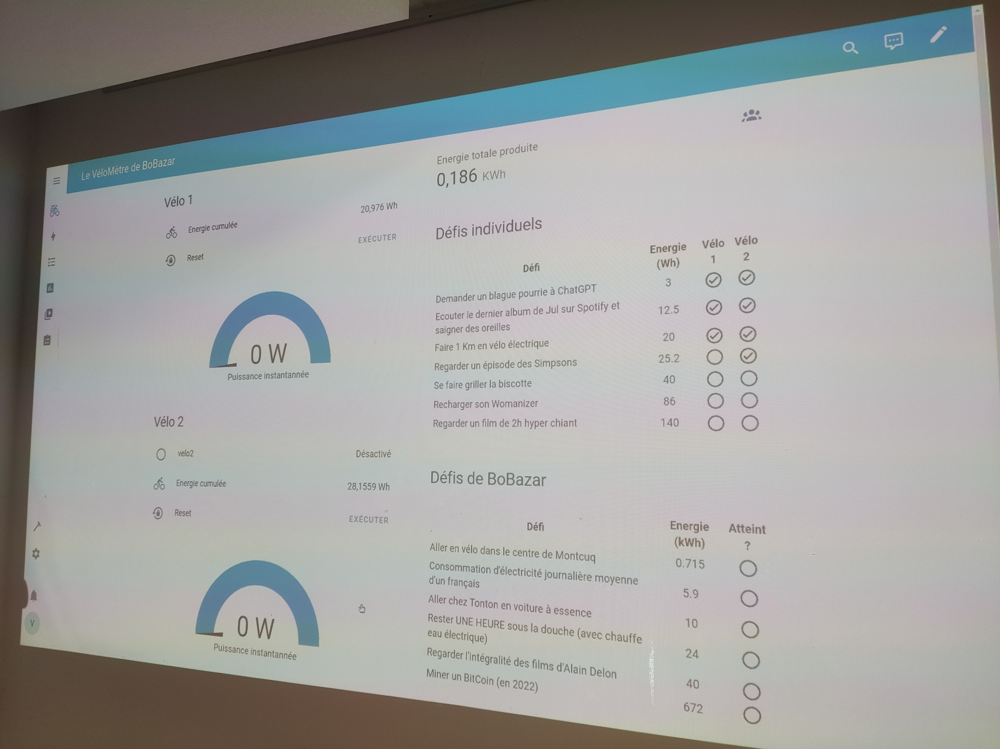

# Vélomètre Bo Bazar

Ce projet permet d'animer un atelier participatif qui a pour objectif de comprendre les ordres de grandeurs de l'énergie que nous utilisons dans des gestes simples du quotidien.

Ce atelier a été proposé dans le cadre du festival BoBazar 2024, à Villeneuve-Tolosane, France.
Dans le cadre de ce festival burlesque, les équivalences énergétique sont décalés.

Dans cet atelier, les festivaliers sont invités à monter sur un vélo (enfant ou adulte) pour pédaler et atteindre des paliers d'équivalence énergétique. Il y a deux echelle: une échelle individuelle en Wh et une échelle globale (énergie acculumée par tous les festivaliers) en kWh.

L'atelier à été créé en utilisant un maximum de matériaux de récupération.
Le logiciel est basé sur Home-Assistant (https://www.home-assistant.io/)

## Installation
 
 ### Matériel:

- Vélo1: Un vélo d'appartement avec une prise Jack 3.5 (mono)
- Vélo2: 
  - Un vélo enfant
  - Un home trainer
  - un compteur de vitesse basique à effet hall (à attacher près de la roue arrière)
- un raspberry pi (3 ou 4) + carte SD (32Go min)
- Un TV/ projecteur pour l'affichage.

### Connections:
- Vélo 1 à brancher sur les ports 3(GPIO-6) et 6(GND). Un connecteur femelle Jack 3.5 est nécessaire
- Vélo 2 : compteur à brancher sur les ports 13(GPIO-27) et 14 (GND).
- Alimentation -> Raspberry PI -> HMDI -> TV

### Lancement du logiciel

- Démarrer le Pi
  - User: root password: raspberry
- Ouvrir un terminal
- si première installation:
  - installer docker: https://www.raspberrypi-france.fr/installer-docker-sur-raspberry-pi/ et docker-compose
  - configuration du remote GPIO : https://gpiozero.readthedocs.io/en/stable/remote_gpio.html
  - installer python3
  - cloner le repository: `git clone https://github.com/pipo114/velometer.git`
- Lancer le vélomètre `cd velometer && ./veloMeter.sh`
- Ouvrir un navigateur et accéder à `http://localhost:8123`